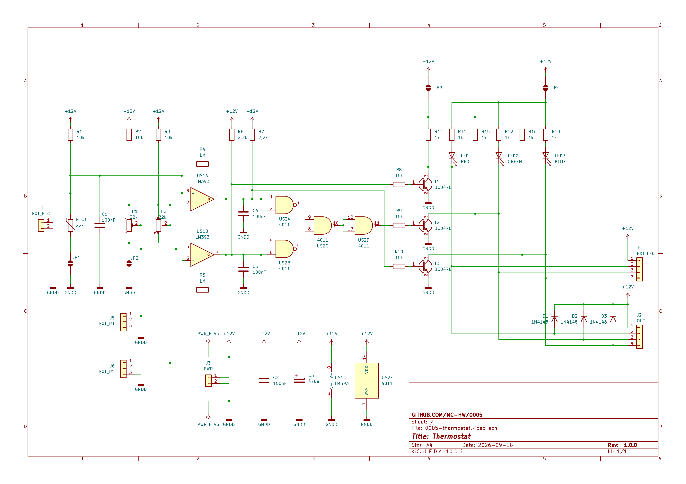

# Thermostat (0005)

A thermostat indicating too _low/OK/to high_ temperature with LEDS.

## Description

This circuit is a copy of [AVT-1742](./AVT1742.pdf) converted to Surface Mounted Technology.

## Assembly

This circuit should be assembled on a double-sided, SMT printed circuit board.

## Running

The device should be powered with 12DCV.

Comparing to the original solution, either a thermistor embedded into the PCB or the external thermistor connected to
junction J1 can be used. Jumper JP1 should be soldered when the embedded thermistor is used, or de-soldered when the
external thermistor is used.

The high/lowh temperature thresholds should be calibrated using potentiometers P1 and P2, or external potentiometers
connected to JP5 and JP6. Jumper JP2 should be soldered when the embedded potentiometers are used, or de-soldered when
the external potentiometers are used.

The thresholds (low/ok/high) are presented with LED1 (high), LED2 (OK) and LED3 (low), or external LEDs connected to
junction J4 (LED current limiting resistors are required, open-collector outputs). Jumper JP3 should be soldered when
the embedded LEDs are used, or de-soldered when the embedded LEDs are not used.

The thresholds can be used to trigger external devices (e.g. using relays). External devices should be connected to
junction J2 (coil current limiting resistors are required, open-collector outputs).

## Bill of materials

[//]: # (TODO)